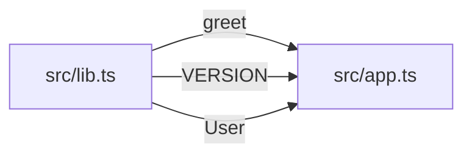

# ts-export-usage-annotator

Ferramenta Rust (SWC) que varre um projeto TypeScript, descobre exports, resolve imports e insere comentarios indicando quais arquivos utilizam cada export. Acompanha um script auxiliar para gerar grafos de dependencias estruturados.

## Quando usar

- O usuario quer saber quais arquivos usam um export
- O usuario quer encontrar exports nao usados (dead code)
- O usuario quer anotar os exports do projeto com comentarios de uso
- O usuario quer mapear dependencias entre arquivos TS
- O usuario quer gerar um grafo de dependencias (Mermaid, DOT, JSON)
- O usuario quer visualizar como exports se propagam entre modulos

## Fluxo de uso

Sempre siga esta sequencia:

### 1. Localizar o tsconfig.json

O flag `--project` aponta para o tsconfig.json do projeto alvo. Se o usuario nao especificar, procure na raiz do projeto. A ferramenta aceita tsconfig.json com comentarios JSON (`/* */` e `//`).

### 2. Rodar em dry-run primeiro

Isso mostra quais arquivos seriam anotados sem modificar nada. E o modo padrao (se nao passar `--write`, e dry-run).

Analise o output para o usuario:
- Listagem de arquivos que seriam alterados
- Quantos exports tem uso vs sem uso
- Se algo parecer errado (poucos exports encontrados, arquivos faltando), investigue antes de prosseguir

### 3. Gerar arquivos anotados (modo seguro)

Cria os arquivos anotados em `.annotated/` preservando os originais. E o modo recomendado para primeira execucao.

### 4. Escrita in-place (modo destrutivo)

Sobrescreve os arquivos originais. So use quando o usuario pedir explicitamente e ja tiver validado o dry-run.

## Interpretando o output

Os comentarios inseridos seguem este formato:

```ts
/* Export NOME usado por: caminho/relativo/arquivo1.ts, caminho/relativo/arquivo2.ts */
```

- Se um export aparece sem comentario de uso, significa que nao foi encontrado nenhum import para ele — possivel dead code.
- Os caminhos sao relativos ao arquivo que contem o export.
- Namespace imports (`import * as X from './y'`) expandem para todos os exports do modulo.
- Re-exports (`export { X } from './y'`) sao rastreados ate o arquivo original.

## Gerando grafos de dependencias

A skill inclui um script auxiliar `scripts/dep_graph.py` que transforma a saida da ferramenta em grafos estruturados. Use-o quando o usuario quiser visualizar dependencias, nao apenas anotar arquivos.

### Grafo Mermaid (para documentacao/README)

```sh
python3 scripts/dep_graph.py --annotated-dir .annotated --source-dir src/ --format mermaid
```

Output exemplo:



### Grafo DOT (para Graphviz)

```sh
python3 scripts/dep_graph.py --annotated-dir .annotated --source-dir src/ --format dot
```

### JSON estruturado (para processamento)

```sh
python3 scripts/dep_graph.py --annotated-dir .annotated --source-dir src/ --format json
```

O JSON inclui: `dependency_graph` (mapa exportador → consumidores), `unused_exports` (lista de dead code), e `stats` (contagens).

### Modo direto (sem diretorio anotado intermediario)

```sh
python3 scripts/dep_graph.py --project tsconfig.json --format mermaid
```

Isso roda a ferramenta internamente, gera anotacoes temporarias, e converte.

## Workaround para rastreamento transitivo

A ferramenta nao rastreia dependencias transitivas atraves de barrel files. Por exemplo, se `app.ts` importa de `index.ts` que re-exporta de `service.ts`, o grafo mostra `service.ts → index.ts` e `index.ts ← app.ts`, mas nao conecta `app.ts` diretamente a `service.ts`.

Para contornar isso, gere o grafo JSON e encadeie manualmente:

1. Rode `dep_graph.py --format json` para obter o mapa completo
2. Identifique barrel files (geralmente `index.ts` que so re-exportam)
3. Para cada dependencia atraves de barrel, substitua o barrel pelo modulo original

Exemplo de encadeamento:

```
service.ts --[Service]--> index.ts (barrel) --[Service]--> app.ts
= service.ts --[Service]--> app.ts (conectado manualmente)
```

## Limitacoes conhecidas

- **Rastreamento transitivo incompleto**: `app.ts -> index.ts -> service.ts` — a ferramenta rastreia `app.ts` usando `index.ts`, e `index.ts` re-exportando de `service.ts`, mas nao conecta `app.ts` diretamente a `service.ts`. O export em `service.ts` aparece como usado por `index.ts`, nao por `app.ts`. Use o script `dep_graph.py` com `--format json` para obter o grafo e encadear manualmente.
- **So arquivos .ts/.tsx**: nao processa .js, .jsx, .mjs
- **Re-exports nao sao registrados como exports do barrel**: se `index.ts` faz `export { X } from './service'`, o `X` e registrado como export de `service.ts`, nao de `index.ts`
- **Namespace expansion e all-or-nothing**: `import * as X` marca TODOS os exports do modulo como usados, mesmo que so alguns sejam efetivamente acessados
- **Tipos somente-type**: imports de tipo (`import type { X }`) sao rastreados como uso, mas a ferramenta nao distingue type-only imports de value imports
